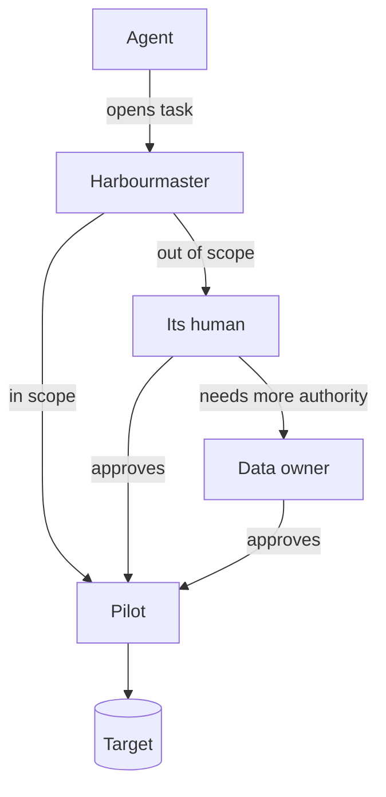

Marque was designed so that a human could be given narrow, expiring, attributable access to
production data. An agent — a language model with tools, a script, a scheduled job — needs exactly
the same thing, more urgently, and at higher volume.

This page is how that works. The decisions are
[EDR-0018](../../edrs/0018-agents-are-submitters-under-intersected-scope.md) and
[EDR-0019](../../edrs/0019-escalation-is-a-chain.md).

## The idea

**An agent is a submitter, never an approver.** It authenticates as itself, acts on behalf of a named
human, runs what is in scope without asking anyone, and refers everything else to that human — who
approves in the console, in seconds, with the full analysis in front of them.



The agent is not blocked when it hits the edge of its authority. It is **supervised**: the work
parks, a person is asked, and it resumes. That is the difference between an agent that can be
trusted with production and one that has to be kept away from it.

## Three scopes, intersected

What an agent may do without asking is the intersection of three separate grants:

```
effective scope  =  operator policy
                 ∩  the human's delegation to this agent
                 ∩  the scope the agent declared for this task
```

The first two are familiar. **The third is the interesting one.**

An agent knows something nobody else does: what *this particular run* actually needs. Sam may have
delegated "you can unstick stuck orders", but this run is about order 88213 and nothing else. So the
agent declares that, at the start of the task, and is held to it:

```jsonc
{
  "on_behalf_of": "sam@acme.example",
  "purpose": "Unstick order 88213 reported in ticket ACME-4471",
  "declared_scope": {
    "target": "prod-primary", "role": "support_writer",
    "operations": ["select", "update"],
    "objects": [ { "schema": "public", "relation": "orders", "columns": ["status", "updated_at"] } ],
    "fence": ["id = '88213'"],
    "max_rows": 1
  },
  "expires_in": "30m"
}
```

The declaration only ever narrows, and it **cannot be widened mid-task**. A statement outside it
escalates even if Sam's delegation would have allowed it — because the agent said it would not need
that, and something has changed.

This is nearly free to implement and produces a signal available nowhere else: **an agent declaring a
wide scope for a narrow task is either badly built or compromised**, and you can see it before
anything runs.

## Writing the delegation in English

An agent's delegation is a delegation like any other, which means it can be written as a sentence and
compiled ([EDR-0016](../../edrs/0016-natural-language-delegations-are-compiled.md)):

> *The support bot can update `status` and `updated_at` on `orders` that have been pending more than
> a day, up to 20 rows at a time, on behalf of anyone in support.*

A model compiles that into a structured scope. **Sam reads and signs the compiled form, not the
sentence** — after which enforcement is entirely deterministic and no model is involved at request
time.

Where a clause genuinely will not compile — *"fix obviously malformed email addresses"* — a
**Surveyor** judges conformance per request, inside the compiled bound Sam signed, with two possible
answers: *conforms*, or *refer to a human*. It can never widen what Sam signed, and any doubt refers.
That bound is what makes the feature safe rather than merely convenient
([EDR-0017](../../edrs/0017-conformance-matching-may-route-never-widen.md)).

## Escalation

When something falls outside the intersection, Marque computes an **escalation chain** and shows it
to the agent immediately, so a person watching the agent work can see it is waiting on Sam rather
than stuck:

| Stage | Who | Why |
|---|---|---|
| 1 | `sam@acme.example` | principal of agent `svc:order-bot` — **always** the first stage |
| 2 | `group:data-oncall` | `orders` is a critical target |

Each stage contributes only the authority it holds. Sam approving does not grant Sam the data
owner's authority; it advances the request to them. **A timeout never approves anything.** Refusal at
any stage ends the request.

When it finally runs, the marque names the agent as the executor and the humans as the authority, so
the logbook sentence is exactly what happened:

> *`svc:order-bot` executed this, on behalf of `sam@acme.example`, authorised by `sam@acme.example`
> and `data-oncall`, at 09:14, affecting 1 row.*

## What an agent never gets

- **A credential.** An agent never holds a database password or a connection. It holds a marque, for
  one statement, that names it.
- **Approval authority.** Approving requires a fresh interactive authentication, which no workload
  principal can satisfy. The prohibition is mechanical, not a rule someone has to remember
  ([EDR-0003](../../edrs/0003-federated-identity-and-sender-constrained-tokens.md)).
- **A shortcut.** Agent requests go through the same fence, the same rehearsal, the same magnitude
  assertions and the same logbook as anyone's. Being an agent changes *who is asked*, never *what is
  checked*.
- **Its human's identity.** It acts under delegation, never impersonation. Every record names both
  ([ZFN-38](https://zrz.io/zfn/38-agents-are-principals/)).

## Containment

| Control | Effect |
|---|---|
| Per-agent quotas, separate from its human's | A runaway agent cannot consume its owner's ability to work |
| Task expiry | An agent that stops mid-task leaves no standing authority |
| One-action revocation | Stops one agent without touching its human's credentials or the agent's other grants |
| Ownership | Every agent has a named owner; an ownerless agent is suspended and reported |
| Anomaly signals | Declared-versus-used scope gap, rising escalation rate, repeated out-of-scope probing, tasks reopened in quick succession |

## Building against it

Two things to design for, and they are the ones integrators get wrong:

- **Escalation takes minutes or hours.** An agent must park work and resume, not block a request
  thread waiting for a human. Marque is explicit about which stage a request is at, so an agent can
  report meaningfully to its own caller.
- **Declare the narrowest scope you can, per task.** Declaring your whole delegation collapses the
  third term of the intersection to nothing and forfeits the best containment available to you. It
  also shows up as an anomaly, which someone will eventually ask you about.
