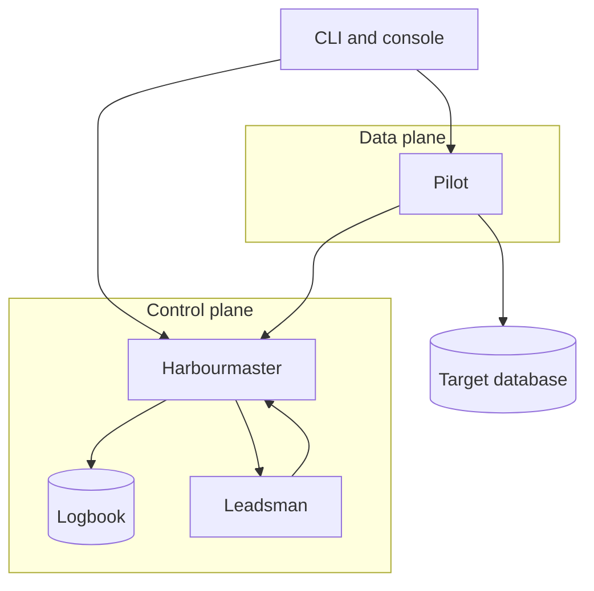
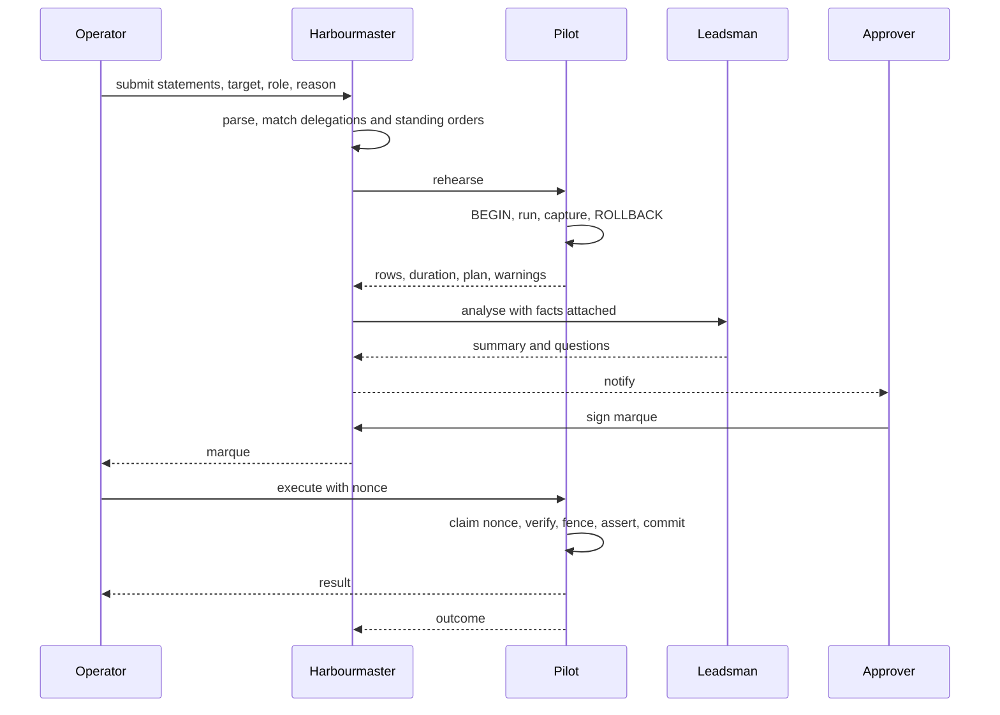
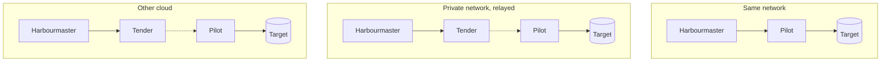

This page is a synthesis of the [decision records](/edrs/). Where the two disagree, the records win.

## The shape

Marque is four components with sharply different trust, deliberately split so that no single one can
both permit an action and perform it.



| Component | Plane | Holds | Never |
|---|---|---|---|
| **Harbourmaster** | control | requests, policy, delegations, the logbook, its own signing key | connects to a target, or holds a target credential |
| **Pilot** | data | target credentials by reference, the connection, the execution ledger | decides whether something may run |
| **Leadsman** | advisory | nothing durable | approves, denies, alters, or executes anything |
| **Tender** | transport | nothing | interprets or terminates what it relays |

The split is not just about scaling ([ZFN-16](https://zrz.io/zfn/16-separate-data-plane-control-plane/)),
it is about **privilege**. The Harbourmaster decides and cannot act. The Pilot acts and cannot
decide. Getting a row changed requires both.

### What each compromise buys an attacker

This table is the design's actual argument, and every record defends a row of it.

| Compromised | Attacker gains | Attacker does **not** gain |
|---|---|---|
| Harbourmaster | read of request text, analyses, approval history; ability to refuse service | any database access; ability to mint a valid marque (no approver key) |
| Pilot | ability to execute marques that already exist and are unexpired; target credentials for its own targets | authority to create new marques; access to targets served by other Pilots |
| Leadsman | ability to write misleading prose into an analysis | any authority; any credential; any other request |
| Tender | traffic analysis and denial of service | statement or result contents (it is not a party to the session) |
| One approver's device key | ability to sign payloads | validity — a marque also needs the Harbourmaster's countersignature under policy |

Two components have to fall together before anything runs that should not, and the pair is always
one machine plus one human's hardware-backed key.

## The object model

| Object | Identity | Lifetime |
|---|---|---|
| **Principal** | federated subject (`sub` + issuer) | as long as the identity provider says |
| **Target** | name | configuration |
| **Role** | name, scoped to a target | configuration |
| **Request** | digest of its canonicalised statements | until decided |
| **Analysis** | digest | immutable, bound into the marque |
| **Marque** | `mrq_…` | `nbf` → `exp`, typically minutes to hours |
| **Execution** | `(marque, nonce)` | permanent in the logbook |
| **Standing order** | name + version | until `expires` |
| **Delegation** | `dlg_…` | until `not_after` |
| **Logbook entry** | sequence number | permanent |

Two identity choices are load-bearing:

- **A request is identified by what it says, not by a row id.** The digest of its canonicalised
  statement text is its name. A marque naming a digest cannot be moved to a different statement, and
  an approver's edit produces a visibly different object rather than mutating the one under review.
- **An execution is identified by a caller-chosen nonce.** That is what makes a retry safe
  ([EDR-0011](../../edrs/0011-execution-is-idempotent-and-fenced.md)).

## The lifecycle of a request



**Submission** ([EDR-0007](../../edrs/0007-delegation-by-containment-proof.md)) parses each statement
and asks whether it is in the *checkable subset* — a single top-level DML statement against a named
base table, with no data-modifying CTEs, no DDL, and no function calls outside an allowlist of known
pure ones. If it is, and a delegation covers its tables and columns, that delegation can carry the
approval. If not, it goes to a human. **The system refuses to guess.**

**Rehearsal** ([EDR-0010](../../edrs/0010-rehearse-before-you-sign.md)) runs the statements on the
Pilot inside a transaction that structurally cannot commit, with a hard statement timeout and a short
lock timeout. The approver gets a measured row count instead of a planner estimate — which on skewed
data is routinely wrong by orders of magnitude, and confidently so.

**Analysis** ([EDR-0009](../../edrs/0009-the-leadsman-is-advisory.md)) assembles the facts from the
parser, the rehearsal, the configuration and the logbook, and asks a model for prose. Every field
carries its provenance. There is no risk score and no recommendation, because those are the shapes
people automate against.

**Approval** ([EDR-0004](../../edrs/0004-marques-are-signed-leases.md)) produces a JWS with two
signatures over one payload:

```jsonc
{
  "mrq": "mrq_01JB2Q9F3K8Z", "target": "prod-primary", "role": "settings_writer",
  "sub": "operator@acme.example", "req": "sha256:9f2c…",
  "nbf": 1786953600, "exp": 1786957200,
  "budget": { "executions": 1, "max_rows": 250 },
  "fence": ["tier = 'sandbox'"],
  "analysis": "sha256:1a7e…"
}
```

`approver` — the human's device key, *this person agreed to this*. `authority` — the Harbourmaster's
key, *policy permitted them to*. Both required.

**Execution** ([EDR-0011](../../edrs/0011-execution-is-idempotent-and-fenced.md)) claims the nonce
and decrements the budget *before* anything runs, so a crash loses the attempt rather than the count.
Then, in one transaction: fence pre-check, the operator's unmodified statements, fence post-assert,
row-count assert, commit.

### The fence, concretely

The delegated row predicate is never conjoined into the operator's `WHERE`. Silently narrowing a
statement produces a partially-applied change nobody reviewed. Instead:

```sql
BEGIN;
-- (a) would this touch anything outside the fence?
SELECT count(*) FROM public.accounts
 WHERE (<statement's own predicate>) AND NOT (tier = 'sandbox');
--    > 0  →  ROLLBACK and report the count

UPDATE public.accounts SET settings = … WHERE … RETURNING id, tier;

-- (c) did any affected row end up outside the fence?   (catches tier := 'production')
-- (d) affected rows <= max_rows
COMMIT;
```

Check **(c)** is the one that is easy to miss: an `UPDATE` can satisfy the fence before and violate
it after.

## Identity

Every principal is federated; there are no local accounts, no passwords and no API keys
([EDR-0003](../../edrs/0003-federated-identity-and-sender-constrained-tokens.md)).

- Humans authenticate by authorization-code flow with PKCE against any issuer the deployment lists.
- Workloads authenticate as their runtime identity — AWS task role, GCP metadata token, or any OIDC
  issuer — and never hold a static cloud key ([ZFN-9](https://zrz.io/zfn/9-no-long-lived-cloud-keys/)).
- Every token is **DPoP-bound** (RFC 9449). A token lifted from a log or a shell history is not
  usable without the private key it names.
- **Signing a marque requires a fresh authentication.** A session from this morning is not an
  approval authority this afternoon. A workload principal can never satisfy freshness, which is how
  "a machine may not approve" is enforced rather than assumed.
- The Leadsman is a principal in its own right and acts under an RFC 8693 `act` delegation from the
  submitter. Every analysis names both ([ZFN-38](https://zrz.io/zfn/38-agents-are-principals/)).

A client is configured with **one URL**
([EDR-0002](../../edrs/0002-bootstrap-discovery-document.md)). The deployment publishes its issuers,
audiences, endpoints, Pilots, relays and capabilities at
`/.well-known/marque-configuration`, and the client discovers everything else from it.

## Storage

Marque's own state is PostgreSQL, and that is fixed
([EDR-0013](../../edrs/0013-async-work-rides-the-wal.md)) — the *targets* it manages are pluggable,
its own store is not.

- **The logbook is an append-only hash-chained journal**
  ([EDR-0012](../../edrs/0012-the-logbook-is-append-only.md)). Marque's role holds `INSERT` and
  `SELECT` on it and nothing else, so rewriting history is not a permission the process has.
- **Current state is a projection**, rebuildable from the journal and disposable.
- **Async work rides the WAL.** `pg_logical_emit_message` inside the committing transaction, consumed
  by a replication listener ([ZFN-48](https://zrz.io/zfn/48-emit-async-work-into-the-wal/)). No job
  table, no polling, and no window where a marque is signed and the notification is lost.
- **The Pilot keeps one durable thing**: its execution ledger. Losing it means the nonce fence is not
  a fence, so a Pilot that has permanently lost its ledger cannot honour outstanding marques.

## Deployment

Three topologies, one client code path.



**Direct** is the simple case: the Pilot is reachable and clients connect to it.

**Relayed** ([EDR-0014](../../edrs/0014-relay-for-targets-with-no-inbound-route.md)) is for a target
with no inbound route, which is most interesting targets. The Pilot dials *out* to a Tender and
serves over that connection. No inbound port is opened anywhere, and the Tender is a dumb pipe — it
authenticates both ends and copies opaque bytes. It is emphatically **not** a tunnel: the Pilot
speaks the Pilot API and nothing else, so there is no port-forward and no shell.

**Cross-cloud** is the same mechanism. A control plane on AWS reaches a target on GCP because the
Pilot beside that target authenticates with its own GCP workload identity and dials out. Neither
cloud is special, and no cloud-specific connectivity primitive is required.

## Failure modes

| Down | Effect |
|---|---|
| Harbourmaster | No new submissions or approvals. **Existing marques still execute** — the Pilot verifies locally. Revocation lists go stale, so `required`-policy marques stop after the refresh interval. |
| Pilot | Its targets are unreachable, and requests for them fail fast with that reason. Other Pilots are unaffected. |
| Leadsman | Requests queue normally with deterministic facts attached and a visible "no summary produced" note. Never blocks. |
| Tender | Its Pilots become unreachable. A direct-mode Pilot is unaffected. |
| Identity provider | Nobody can submit or approve. Already-signed marques still execute. |
| WAL listener | Notifications and projections stall. **The replication slot retains WAL and can fill the primary's disk** — this is the alert that matters most. |

The pattern is deliberate: **an incident in progress can still be worked with grants already
issued.** [ZFN-4](https://zrz.io/zfn/4-incident-tooling-independence/) is why the marque is a signed
artefact rather than a row in a table someone has to be able to read.

## Interfaces

**Schema-first** ([ZFN-14](https://zrz.io/zfn/14-schema-first-apis-generate-clients/)): one protobuf
definition generates the Go server stubs, the CLI's client, and the console's client. Nothing
hand-builds a request or hand-parses a response.

Three surfaces, all over the same schema:

- **CLI** — `marque submit`, `approve`, `run`, `delegate`, `orders`, `log`, `policy apply`. The
  primary interface, and the one that works during an incident.
- **Console** — review, approve, browse the logbook, see delegations and standing orders. Reading is
  most of what it does.
- **Notifications** — Slack first, driven off the WAL stream, so an approver is asked where they
  already are.

## Open questions

Honest gaps at design time, listed so they are not discovered as surprises:

- **Approver fatigue.** Nothing here stops a tired human reading the summary and skipping the SQL.
  Provenance markers help; they do not solve it.
- **Erasure versus an immutable journal.** Statement text may contain personal data, and the logbook
  cannot be edited. Redacting samples by default reduces the surface without closing the question
  ([EDR-0012](../../edrs/0012-the-logbook-is-append-only.md)).
- **The checkable subset will feel arbitrary** until it has met a few hundred real statements. Its
  boundary is a versioned artefact, so widening it later does not retroactively change what an old
  delegation permitted.
- **A second engine is a second parser.** MySQL is real work, not a configuration flag.

## Reading the records

Start with [EDR-0001](../../edrs/0001-marque-platform-architecture.md) for the whole shape, then
[EDR-0004](../../edrs/0004-marques-are-signed-leases.md) and
[EDR-0005](../../edrs/0005-control-plane-holds-no-credentials.md) — between them they are the entire
security argument. [EDR-0007](../../edrs/0007-delegation-by-containment-proof.md) is the hardest and
most interesting one.
