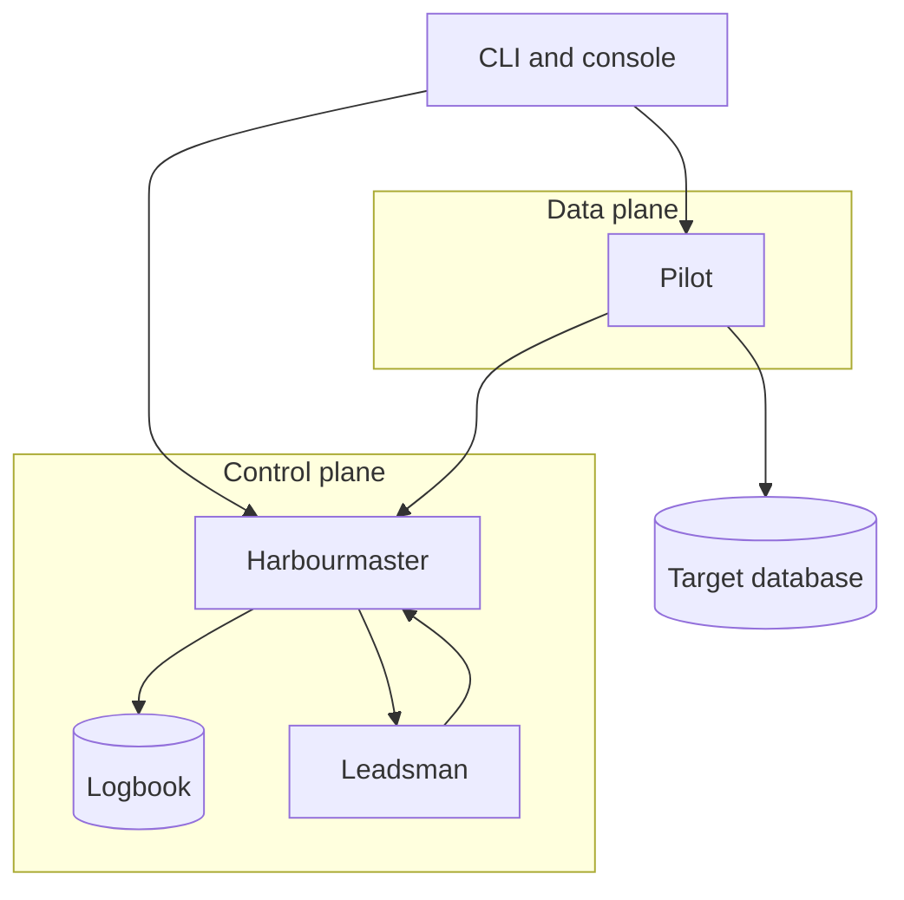
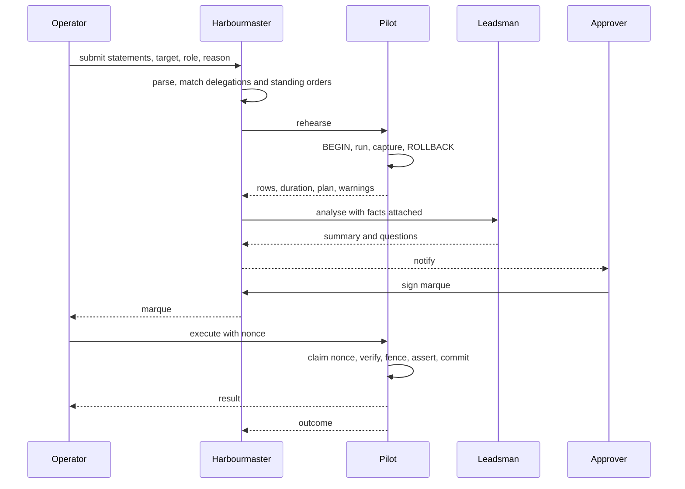
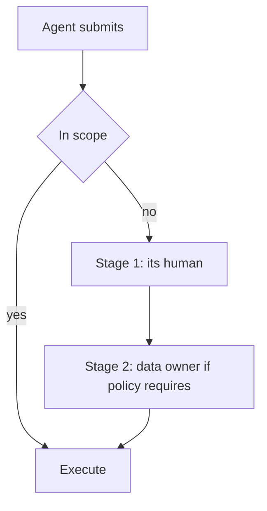
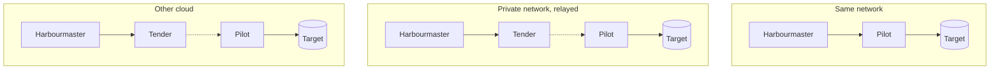

This page is a synthesis of the [decision records](/edrs/). Where the two disagree, the records win.

## The shape

Marque is five components with sharply different trust, deliberately split so that no single one can
both permit an action and perform it.



| Component | Plane | Holds | Never |
|---|---|---|---|
| **Harbourmaster** | control | requests, policy, delegations, the logbook, its own signing key | connects to a target, or holds a target credential |
| **Pilot** | data | target credentials by reference, the connection, the execution ledger | decides whether something may run |
| **Leadsman** | advisory | nothing durable | approves, denies, alters, or executes anything |
| **Surveyor** | conformance | nothing durable | widens a bound, denies, or resolves doubt toward yes |
| **Tender** | transport | nothing | interprets or terminates what it relays |

The split is not just about scaling ([ZFN-16](https://zrz.io/zfn/16-separate-data-plane-control-plane/)),
it is about **privilege**. The Harbourmaster decides and cannot act. The Pilot acts and cannot
decide. Getting a row changed requires both.

### What each compromise buys an attacker

This table is the design's actual argument, and every record defends a row of it.

| Compromised | Attacker gains | Attacker does **not** gain |
|---|---|---|
| Harbourmaster | read of request text, analyses, approval history; ability to refuse service; a **bounded, quota'd, target-visible read channel** by relaying operator-signed rehearsals ([EDR-0034](../../edrs/0034-the-pilot-api-has-one-authorisation-model.md)); **on a fast path, ability to invoke a genuine standing order as a principal of its choosing where `invokers` names a group** ([EDR-0029](../../edrs/0029-the-fast-path-authority-chain.md)) | any database access; ability to mint a marque for a statement shape no human signed — it has no approver key, and a fast-path marque must carry the human-signed artefact that authorised it |
| Pilot | ability to execute marques that already exist and are unexpired; target credentials for its own targets | authority to create new marques; access to targets served by other Pilots |
| Leadsman | ability to write misleading prose into an analysis | any authority; any credential; any other request |
| Surveyor | ability to route a request onto the fast path **within a scope a human already signed** | the ability to widen that scope, deny anything, or reach a request outside a Tier-B delegation |
| Tender | traffic analysis and denial of service | statement or result contents (it is not a party to the session) |
| One approver's device key | ability to sign payloads | validity — a marque also needs the Harbourmaster's countersignature under policy |

Two components have to fall together before anything runs that should not, and the pair is always one
machine plus one human's hardware-backed key — **with one stated exception**: on a fast path whose
standing order names a *group* in `invokers`, a compromised control plane can invoke a genuine order
as a principal of its choosing, at unbounded volume, bounded only to that order's approved shape and
parameter constraints ([EDR-0029](../../edrs/0029-the-fast-path-authority-chain.md)).

## The object model

| Object | Identity | Lifetime |
|---|---|---|
| **Principal** | federated subject (`sub` + issuer) | as long as the identity provider says |
| **Target** | name | configuration |
| **Role** | name, scoped to a target | configuration |
| **Request** | digest of its canonicalised statements | until decided |
| **Analysis** | digest | immutable, bound into the marque |
| **Marque** | `mrq_…` | `nbf` → `exp`, typically minutes to hours |
| **Execution** | `(marque, nonce)` | permanent in the logbook |
| **Standing order** | name + version | until `expires` |
| **Delegation** | `dlg_…` | until `not_after` |
| **Logbook entry** | sequence number | permanent |

Two identity choices are load-bearing:

- **A request is identified by what it says, not by a row id.** The digest of its canonicalised
  statement text is its name. A marque naming a digest cannot be moved to a different statement, and
  an approver's edit produces a visibly different object rather than mutating the one under review.
- **An execution is identified by a caller-chosen nonce.** That is what makes a retry safe
  ([EDR-0011](../../edrs/0011-execution-is-idempotent-and-fenced.md)).

## The lifecycle of a request



**Submission** ([EDR-0007](../../edrs/0007-delegation-by-containment-proof.md)) parses each statement
and asks whether it is in the *checkable subset* — a single top-level DML statement against a named
base table, with no data-modifying CTEs, no DDL, and no function calls outside an allowlist of known
pure ones. If it is, and a delegation covers its tables and columns, that delegation can carry the
approval. If not, it goes to a human. **The system refuses to guess.**

**Rehearsal** ([EDR-0010](../../edrs/0010-rehearse-before-you-sign.md)) runs the statements on the
Pilot inside a transaction that structurally cannot commit, with a hard statement timeout and a short
lock timeout. The approver gets a measured row count instead of a planner estimate — which on skewed
data is routinely wrong by orders of magnitude, and confidently so.

**Analysis** ([EDR-0009](../../edrs/0009-the-leadsman-is-advisory.md)) assembles the facts from the
parser, the rehearsal, the configuration and the logbook, and asks a model for prose. Every field
carries its provenance. There is no risk score and no recommendation, because those are the shapes
people automate against.

**Approval** ([EDR-0004](../../edrs/0004-marques-are-signed-leases.md)) produces a JWS with two
signatures over one payload:

```jsonc
{
  "mrq": "mrq_01JB2Q9F3K8Z", "tenant": "acme", "target": "prod-primary",
  "role": "settings_writer", "pilot": "pilot-us-west-2",
  "sub": "operator@acme.example", "cnf": { "jkt": "…" },
  "req": "sha256:9f2c…", "analysis": "sha256:1a7e…",
  "nbf": 1786953600, "exp": 1786957200,
  "budget": { "executions": 1, "max_rows": 250 },
  "fence": ["tier = 'sandbox'"],
  "approvals": { "stages": [ { "n": 1, "required": 1, "eligible": [ … ] },
                             { "n": 2, "required": 1, "eligible": [ … ] } ],
                 "chain": "sha256:…" },
  "roster_epoch": 47, "objects": [ … ], "machinery": "sha256:…",
  "display": "…", "require_execution_presence": false,
  "auth": { "kind": "interactive" }
}
```

`approver` — the human's device key, *this person agreed to this*. `authority` — the Harbourmaster's
key, *policy permitted them to*. Both required.

Five of those fields exist because review found the design asserting properties nothing enforced.
`display` is a canonical rendering covered by every signature, because a WebAuthn challenge is an
opaque digest and the console's assets are served by the control plane — so without it an authentic
signature can be induced over a payload nobody saw
([EDR-0036](../../edrs/0036-what-is-signed-must-be-what-was-seen.md)).
`auth` names the human-signed artefact when no human is present at mint time
([EDR-0029](../../edrs/0029-the-fast-path-authority-chain.md)); `approvals` states the requirement
inside what every signature covers, so a signature cannot be stripped
([EDR-0030](../../edrs/0030-a-marque-states-its-own-approval-requirement.md)); and `cnf`, `tenant`
and `pilot` bind the caller, the tenant and the executing Pilot
([EDR-0032](../../edrs/0032-a-marque-binds-its-executor-tenant-and-pilot.md)). The approver keys the
Pilot checks all this against come from a roster anchored **outside** the control plane
([EDR-0031](../../edrs/0031-approver-keys-are-anchored-outside-the-control-plane.md)) — without that,
the rest is theatre.

**Execution** ([EDR-0011](../../edrs/0011-execution-is-idempotent-and-fenced.md)) claims the nonce
and decrements the budget *before* anything runs, so a crash loses the attempt rather than the count.
Then, in one transaction: fence pre-check, the operator's unmodified statements, fence post-assert,
row-count assert, commit.

### The statement pipeline

Every statement, from every surface, moves through one named pipeline
([EDR-0028](../../edrs/0028-statement-pipeline-and-provider-spi.md)). Configured, out-of-process
**providers** may join two of its stages: `transform` (rewrite — inject a constraint, map a name,
synthesise a value, add a cast) and `verify` (inspect and veto, possibly asynchronously).

```
parse → transform* → normalise+digest → scope → verify* → rehearse → analyse
      → approve → pre_execute* → execute+fence → observe*        (* = providers)
```

One rule governs the whole extension point: **a provider may narrow or veto, never widen, permit or
replace a check.** Three things enforce it rather than requesting it — the digest is taken *after*
transformation so a human signs what will actually run; scope and fence re-run on the transformed
statement, so a rogue transform is bounded by the submitter's own authority; and there is no stage at
which a provider can disable the fence, the magnitude assertion, marque verification or the role.

The line for deciding what may become a provider: **if disabling it would let something run that
otherwise could not, it is not a provider.** The analyser sits on the SPI as an evidence-only
`analyse` provider; the Surveyor sits on it as a **routing** provider whose outcomes are
`conforms`/`refer` — it selects a route inside a human-signed bound and **cannot deny**, since denial
is a human act. The containment check, the fence, signature verification, the nonce and the logbook
never will.

### The fence, concretely

The delegated row predicate is never conjoined into the operator's `WHERE`. Silently narrowing a
statement produces a partially-applied change nobody reviewed. Instead:

```sql
-- first, its own round trip: the lexer reads these, and a simple-query
-- message is raw-parsed whole, so a SET beside the fence is inert
SET standard_conforming_strings = on;       -- verified with current_setting()
SET backslash_quote             = off;

BEGIN ISOLATION LEVEL REPEATABLE READ;      -- READ COMMITTED is unsound here
SET LOCAL search_path = pg_catalog;         -- else an unqualified fence can be redefined
-- capture write-set baseline (a delta, not a snapshot)

-- (a) would this touch anything outside the fence?
--     `IS NOT TRUE`, never `NOT (…)` — a NULL fence value is OUTSIDE the fence
--     `<fence>` is the bare conjunction, each conjunct parenthesised:
--     `(c1) AND (c2)`. The parens below are the outer wrap, giving
--     `((c1) AND (c2)) IS NOT TRUE`. `IS` binds tighter than `AND`.
SELECT count(*) FROM public.accounts
 WHERE (<statement's own predicate>) AND (<fence>) IS NOT TRUE;
--    > 0  →  ROLLBACK and report the count

-- re-verify the pins: evaluating the fence above may have called a function
UPDATE public.accounts SET settings = … WHERE … RETURNING id, tier;

-- re-verify the pins: a BEFORE trigger can call set_config and move them
-- (c) did any affected row end up outside the fence?   (catches tier := 'production')
-- (d) affected rows <= max_rows                        (named relation only)
SET CONSTRAINTS ALL IMMEDIATE;              -- deferred triggers must fire before (e)
-- re-verify the pins: (c) evaluated the fence and this ran trigger code
-- (e) write-set assert: nothing outside the marque's `objects` was written
COMMIT;
```

Six things here are easy to get wrong and each fails **open**: `NOT (fence)` lets a row with a NULL
fence column pass every check ([EDR-0007](../../edrs/0007-delegation-by-containment-proof.md));
joining conjuncts as `c1 AND c2` rather than `(c1) AND (c2)` lets one carrying a top-level `OR`
rebind against the following `AND`; the
session pins do not survive code the Pilot did not compose — a fence conjunct may call a function, a
`BEFORE` trigger may, and so may a deferred constraint trigger fired by `SET CONSTRAINTS` — so they
are re-verified before every step that follows any of it;
composing a multi-conjunct fence as `(c1) AND (c2) IS NOT TRUE` rather than
`((c1) AND (c2)) IS NOT TRUE` applies the TRUE-only test to the last conjunct alone, so a row failing
any earlier one is never counted ([EDR-0041](../../edrs/0041-one-spelling-for-a-scope.md));
READ COMMITTED lets the pre-check and the statement see different snapshots; and **(e)** is what
bounds writes the engine performs on the statement's behalf — a cascading delete returns one row and
can destroy millions in a table no delegation names
([EDR-0033](../../edrs/0033-assert-the-whole-write-set-not-just-the-named-relation.md)). Check **(c)**
catches an `UPDATE` that satisfies the fence before and violates it after.

## Agents and escalation

An agent is a **submitter, never an approver**
([EDR-0018](../../edrs/0018-agents-are-submitters-under-intersected-scope.md)). It authenticates as
itself, acts on behalf of a named human, and what it may run without asking is:

```
operator policy  ∩  its human's delegation to it  ∩  the scope it declared for this task
```

The third term is the novel one. An agent opens a task declaring the least it needs — *"orders,
`status` and `updated_at`, where `id = '88213'`, at most 1 row, 30 minutes"* — and is held to it. It
attenuates only, cannot be widened mid-task, and expires. A declared scope much wider than what the
task used is an anomaly signal that exists in no other design.

Anything outside escalates rather than failing
([EDR-0019](../../edrs/0019-escalation-is-a-chain.md)). The chain is computed at submission and shown
immediately:



Stage 1 for an agent is **always its principal**, whether or not policy would otherwise require them.
Each stage contributes only the authority it holds, every stage is a person, and **a timeout never
approves**. The resulting marque names the agent as executor with an RFC 8693 `act` chain naming the
humans, so the record reads: *the agent ran it, on Sam's behalf, authorised by Sam and the data
on-call.*

### Where models sit, and what bounds them

Two model principals, deliberately different characters:

| | Leadsman | Surveyor |
|---|---|---|
| Job | writes the summary an approver reads | answers whether a request conforms to a signed scope |
| Outputs | prose, questions | exactly two values: `conforms`, `refer` |
| Authority | none at all | chooses a route inside a human-signed bound |
| On doubt | irrelevant — it decides nothing | refer |

A written delegation is **compiled once** by a model into a structured scope, and the grantor signs
**the compilation, not the sentence**
([EDR-0016](../../edrs/0016-natural-language-delegations-are-compiled.md)). Where the whole sentence
compiles — Tier A, the preferred case — no model runs at request time at all and enforcement is
100% deterministic. Only a clause with no structured equivalent needs the Surveyor, and even then it
sits *inside* the compiled bound, with a unanimous three-way panel, default-refer, ingress quotas, a
sampled after-the-fact human audit that can automatically suspend the fast path, and a polled kill
switch that defaults off ([EDR-0017](../../edrs/0017-conformance-matching-may-route-never-widen.md)).

The invariant across all of it: **a model can never create authority a human did not sign.** The
worst a model error achieves is failing to escalate something that was already inside a signed scope,
where the fence and the magnitude assertions still run.

## Identity

Every principal is federated; there are no local accounts, no passwords and no API keys
([EDR-0003](../../edrs/0003-federated-identity-and-sender-constrained-tokens.md)).

- Humans authenticate by authorization-code flow with PKCE against any issuer the deployment lists.
- Workloads authenticate as their runtime identity — AWS task role, GCP metadata token, or any OIDC
  issuer — and never hold a static cloud key ([ZFN-9](https://zrz.io/zfn/9-no-long-lived-cloud-keys/)).
- Every token is **DPoP-bound** (RFC 9449). A token lifted from a log or a shell history is not
  usable without the private key it names.
- **Signing a marque requires a fresh authentication.** A session from this morning is not an
  approval authority this afternoon. A workload principal can never satisfy freshness, which is how
  "a machine may not approve" is enforced rather than assumed.
- The Leadsman is a principal in its own right and acts under an RFC 8693 `act` delegation from the
  submitter. Every analysis names both ([ZFN-38](https://zrz.io/zfn/38-agents-are-principals/)).

A client is configured with **one URL**
([EDR-0002](../../edrs/0002-bootstrap-discovery-document.md)). The deployment publishes its issuers,
audiences, endpoints, Pilots, relays and capabilities at
`/.well-known/marque-configuration`, and the client discovers everything else from it.

## Storage

Marque's own state is PostgreSQL, and that is fixed
([EDR-0013](../../edrs/0013-async-work-rides-the-wal.md)) — the *targets* it manages are pluggable,
its own store is not.

- **The logbook is an append-only hash-chained journal**
  ([EDR-0012](../../edrs/0012-the-logbook-is-append-only.md)). Marque's role holds `INSERT` and
  `SELECT` on it and nothing else, so rewriting history is not a permission the process has.
- **Current state is a projection**, rebuildable from the journal and disposable.
- **Async work rides the WAL.** `pg_logical_emit_message` inside the committing transaction, consumed
  by a replication listener ([ZFN-48](https://zrz.io/zfn/48-emit-async-work-into-the-wal/)). No job
  table, no polling, and no window where a marque is signed and the notification is lost.
- **The Pilot keeps one durable thing**: its execution ledger. Losing it means the nonce fence is not
  a fence, so a Pilot that has permanently lost its ledger cannot honour outstanding marques.

## Deployment

Three topologies, one client code path.



**Direct** is the simple case: the Pilot is reachable and clients connect to it.

**Relayed** ([EDR-0014](../../edrs/0014-relay-for-targets-with-no-inbound-route.md)) is for a target
with no inbound route, which is most interesting targets. The Pilot dials *out* to a Tender and
serves over that connection. No inbound port is opened anywhere, and the Tender is a dumb pipe — it
authenticates both ends and copies opaque bytes. It is emphatically **not** a tunnel: the Pilot
speaks the Pilot API and nothing else, so there is no port-forward and no shell.

**Cross-cloud** is the same mechanism. A control plane on AWS reaches a target on GCP because the
Pilot beside that target authenticates with its own GCP workload identity and dials out. Neither
cloud is special, and no cloud-specific connectivity primitive is required.

## Failure modes

| Down | Effect |
|---|---|
| Harbourmaster | No new submissions or approvals. **Existing marques still execute** — the Pilot verifies locally — **until the revocation list goes stale**, after which only `revocation.policy: grace` marques run. That window is the honest bound on the offline property, and `max_grace_seconds` ([EDR-0015](../../edrs/0015-policy-is-reviewed-configuration.md)) caps how far an approver may extend it. |
| Pilot | Its targets are unreachable, and requests for them fail fast with that reason. Other Pilots are unaffected. |
| Leadsman | Requests queue normally with deterministic facts attached and a visible "no summary produced" note. Never blocks. |
| Surveyor | Tier-B delegations fall back to referring everything to a human. Tier-A delegations are unaffected, because no model was in their path. |
| Tender | Its Pilots become unreachable. A direct-mode Pilot is unaffected. |
| Identity provider | Nobody can submit or approve. **Already-signed marques still execute, unconditionally** — the caller proves possession of the key the marque names rather than presenting a token ([EDR-0032](../../edrs/0032-a-marque-binds-its-executor-tenant-and-pilot.md), [EDR-0035](../../edrs/0035-execution-freshness-is-a-property-of-the-approval.md)). |
| WAL listener | Notifications and projections stall. **The replication slot retains WAL and can fill the primary's disk** — this is the alert that matters most. |

The pattern is deliberate: **an incident in progress can still be worked with grants already
issued.** [ZFN-4](https://zrz.io/zfn/4-incident-tooling-independence/) is why the marque is a signed
artefact rather than a row in a table someone has to be able to read.

## Interfaces

**Schema-first** ([ZFN-14](https://zrz.io/zfn/14-schema-first-apis-generate-clients/)): one protobuf
definition generates the Go server stubs, the CLI's client, and the console's client. Nothing
hand-builds a request or hand-parses a response.

Three surfaces, all over the same schema:

- **CLI** — `marque submit`, `approve`, `run`, `delegate`, `orders`, `log`, `policy apply`. The
  primary interface, and the one that works during an incident.
- **Console** — review, approve, browse the logbook, see delegations and standing orders. Reading is
  most of what it does.
- **Notifications** — Slack first, driven off the WAL stream, so an approver is asked where they
  already are.

## Open questions

Honest gaps at design time, listed so they are not discovered as surprises:

- **Approver fatigue.** Nothing here stops a tired human reading the summary and skipping the SQL.
  Provenance markers help; they do not solve it. Escalation chains and agent volume both push in the
  wrong direction here, which is why standing orders and Tier-A compiled delegations matter more than
  they look.
- **A grantor may sign a compilation they did not read.** The same problem as approver fatigue,
  moved to the moment of delegation, where it has a longer half-life
  ([EDR-0016](../../edrs/0016-natural-language-delegations-are-compiled.md)).
- **Tier B is the most dangerous thing in the system.** Every constraint on it is load-bearing, and
  the sampled audit is the only mechanism that makes it *correctable* rather than merely bounded —
  so an audit queue nobody reads silently removes the mitigation.
- **Erasure versus an immutable journal.** Statement text may contain personal data, and the logbook
  cannot be edited. Redacting samples by default reduces the surface without closing the question
  ([EDR-0012](../../edrs/0012-the-logbook-is-append-only.md)).
- **The checkable subset will feel arbitrary** until it has met a few hundred real statements. Its
  boundary is a versioned artefact, so widening it later does not retroactively change what an old
  delegation permitted.
- **A second engine is a second parser.** MySQL is real work, not a configuration flag.

## Reading the records

Start with [EDR-0001](../../edrs/0001-marque-platform-architecture.md) for the whole shape, then
[EDR-0004](../../edrs/0004-marques-are-signed-leases.md) and
[EDR-0005](../../edrs/0005-control-plane-holds-no-credentials.md) — between them they are the entire
security argument. [EDR-0007](../../edrs/0007-delegation-by-containment-proof.md) is the hardest and
most interesting one.

For the agent surface, read
[EDR-0018](../../edrs/0018-agents-are-submitters-under-intersected-scope.md) and
[EDR-0019](../../edrs/0019-escalation-is-a-chain.md), then
[EDR-0016](../../edrs/0016-natural-language-delegations-are-compiled.md) and
[EDR-0017](../../edrs/0017-conformance-matching-may-route-never-widen.md) — 0017 is where a model
comes closest to authority, and it is the one to attack hardest.
