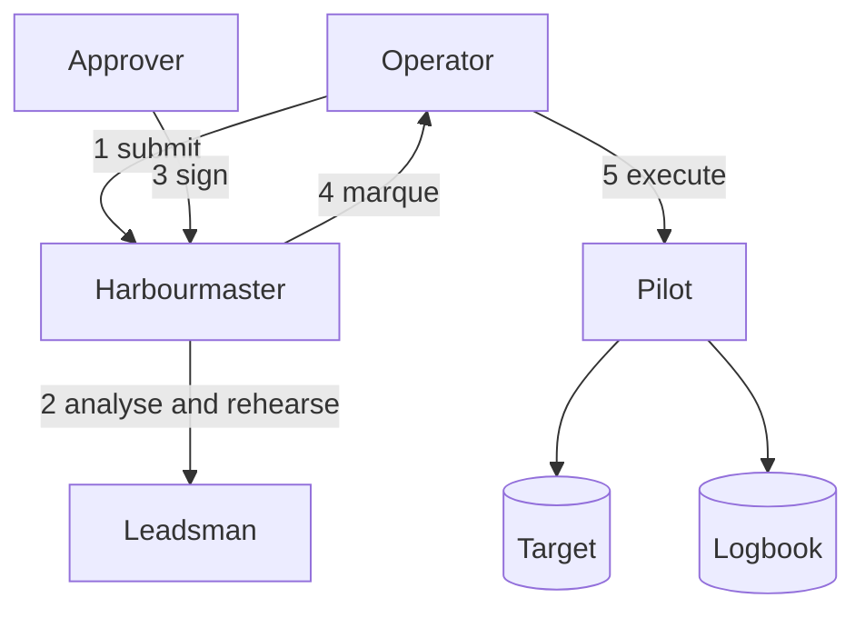

Marque is a broker for statements run against production data stores.

Instead of someone holding a production credential and running SQL at a prompt, they **submit** the
statement. It is analysed, a human with authority over that database **approves** it by signing a
grant — a *marque* — with a validity window and an execution budget, and only then does it run:
that exact statement, as that role, inside that window, once.

Everything that happens is appended to a journal that names who asked, who approved, what they were
shown, and what changed.

## The problem

Every organisation running a database in production eventually changes something in it by hand. A
migration went wrong. A customer is stuck in a state the admin UI cannot express. A flag needs
flipping before the feature that sets it properly has shipped.

The usual answers share one flaw: **the authorisation and the action are different objects.**

- **Standing credentials.** Someone has the password. It does not expire, its use is invisible, and
  the blast radius is the whole schema.
- **A shared console with session recording.** The log records that a session happened, not what was
  authorised. Nobody approved anything.
- **A Slack thread and a screen share.** The approval is real, human, and gone within the hour.
  Nothing durable connects "yes, do it" to what was actually executed.
- **Locking it down completely.** Then the on-call engineer at 3am has no path, and someone keeps a
  break-glass credential in a password manager — which is the first answer with extra steps.

There is no artefact anyone can point at that says *this exact statement, by this person, as this
role, until this time*. Marque makes that artefact the only way in.

## How it works



1. **Submit.** An operator names a target, a role, one or more statements, and a reason.
2. **Sound.** The statements are parsed for what they touch, and *rehearsed* — run inside a
   transaction that is always rolled back — so the affected row count is measured rather than
   guessed. A language model writes a plain summary beside those facts. It cannot approve anything.
3. **Review.** An approver reads the statement, the measured numbers, and the summary. They can edit
   the statement, narrow the window, or refuse.
4. **Sign.** Approval produces a marque: a signed grant naming the statement's digest, the role, the
   submitter, a not-before, an expiry and a budget. It carries the approver's own signature *and*
   the control plane's — neither can produce a valid one alone.
5. **Run.** The submitter executes. The database checks its grants, Marque checks the fence and the
   row count, and the transaction commits or rolls back whole.
6. **Log.** Statement, analysis, signature, result — appended, never edited.

Routine work never reaches step 3. **Standing orders** are statements approved once and invoked with
constrained parameters; **delegation** lets an approver hand a narrow slice of their authority to
someone else, with an expiry. A delegation can be written as a sentence — *"Sam can update `settings`
on sandbox accounts, up to 100 rows"* — which a model compiles into a structured scope that Sam's
grantor reads and signs. After that the enforcement is entirely deterministic
([EDR-0016](../../edrs/0016-natural-language-delegations-are-compiled.md)).

## Agents

The same machinery is what lets an **agent** touch production safely, and it is the use case Marque
is aimed squarely at.

An agent — a language model with tools, a script, a scheduled job — is a **submitter, never an
approver**. It authenticates as itself, acts on behalf of a named human, and runs what is in scope
without asking anyone. What it may do without asking is the intersection of three grants:

```
operator policy  ∩  its human's delegation  ∩  the scope the agent declared for this task
```

That third term is the one nothing else has. An agent knows what *this run* actually needs — order
88213 and nothing else — so it declares that at the start of the task and is held to it. An agent
declaring a wide scope for a narrow task is visible before anything runs.

Anything outside is not refused, it is **escalated**: to that human first, always, and then to whoever
policy additionally requires. The agent parks, a person is asked with the full analysis in front of
them, and the work resumes. When it runs, the record says exactly what happened — *the agent executed
it, on Sam's behalf, authorised by Sam and the data on-call.*

An agent never holds a credential, never approves anything, and gets no shortcut through any check.
See [Agents](../concepts/agents.md).

## What Marque is not

- **Not a pass-through tunnel.** There *is* an SQL shell, and a loopback proxy that speaks the
  PostgreSQL wire protocol so psql and your existing tools work unchanged — but every statement
  crossing it is parsed, scoped, fenced and logged. It forwards no bytes
  ([EDR-0022](../../edrs/0022-local-proxy-brokers-every-statement.md)).
- **Not a migration tool.** Schema changes belong in a migration pipeline with a review, a rollback
  and a deploy. Marque is for the one-off that a pipeline cannot express.
- **Not a privilege manager.** It never grants privileges on your database. The role's existing
  grants are the outer bound on everything it can authorise
  ([EDR-0006](../../edrs/0006-every-statement-names-a-role.md)).
- **Not a network bastion.** A Pilot inside your network speaks one narrow API. There is no port
  forwarding and no shell ([EDR-0014](../../edrs/0014-relay-for-targets-with-no-inbound-route.md)).
- **Not a place where a model creates authority.** The analyser holds none at all
  ([EDR-0009](../../edrs/0009-the-leadsman-is-advisory.md)). A model may *compile* a written
  delegation, which a human then signs, and it may *route* a request as conforming or referred —
  always inside a deterministic bound a human already signed, and always referring on doubt
  ([EDR-0017](../../edrs/0017-conformance-matching-may-route-never-widen.md)). The worst a model
  error can do is fail to escalate something already within a signed scope.

## Design commitments

Six properties the design gives other things up to keep:

| Commitment | Why it holds |
|---|---|
| A control-plane compromise grants no credential and cannot commit a change | It holds no target credential ([EDR-0005](../../edrs/0005-control-plane-holds-no-credentials.md)) and cannot sign a marque alone ([EDR-0004](../../edrs/0004-marques-are-signed-leases.md)). A bounded, quota'd, target-visible read channel remains ([EDR-0034](../../edrs/0034-the-pilot-api-has-one-authorisation-model.md)) |
| An issued marque works while the control plane is down, for as long as the Pilot's revocation list is fresh | The Pilot verifies it by computation, not by asking; past that window only `revocation.policy: grace` marques run ([EDR-0004](../../edrs/0004-marques-are-signed-leases.md)) |
| No standing access, anywhere | Marques, standing orders and delegations all expire ([ZFN-37](https://zrz.io/zfn/37-every-lock-is-a-lease/)) |
| No anonymous actor | Every principal is federated, including the machine ones ([EDR-0003](../../edrs/0003-federated-identity-and-sender-constrained-tokens.md)) |
| Nothing is silently narrowed | A statement outside your delegated scope aborts and says by how much ([EDR-0007](../../edrs/0007-delegation-by-containment-proof.md)) |
| A retry never double-applies | Executions are fenced by a nonce claimed before the statement runs ([EDR-0011](../../edrs/0011-execution-is-idempotent-and-fenced.md)) |
| No model can create authority | A model compiles or routes; a human signs the bound, and the fence still runs ([EDR-0017](../../edrs/0017-conformance-matching-may-route-never-widen.md)) |
| An agent is supervised, not blocked | Out-of-scope work escalates to its human rather than failing ([EDR-0019](../../edrs/0019-escalation-is-a-chain.md)) |

## Status

**Design.** The decision records are published and implementation has not started. Nothing here runs
in production anywhere yet. See [Scope](./scope.md) for what is in the first release and what is
deliberately deferred.

## Using it

```sh
marque submit --target prod-primary --role settings_writer -f fix.sql --reason "ACME-4471"
marque sql    --target prod-primary --role settings_writer          # an interactive shell
marque proxy  --target prod-primary --role settings_writer --port 15432
psql "host=127.0.0.1 port=15432 dbname=app"                          # your tools, unchanged

alias psql='marque psql'                                             # or replace psql outright
```

The proxy emulates the PostgreSQL wire protocol on loopback and brokers every statement that crosses
it. Anything outside your scope does not hang — it returns immediately with the request id and who is
being waited on, so you can approve it elsewhere and re-run.

## Where next

- [Architecture](./architecture.md) — the components, the object model, and the trust boundaries.
- [Scope](./scope.md) — what is in, what is out, the phases, and the prior art.
- [Implementation plan](./implementation-plan.md) — how Phase 1 gets built, in what order, and what
  proves each step.
- [Ideas](./ideas.md) — candidates that are not decided, and two that are already refused.
- [Agents](../concepts/agents.md) — three intersected scopes, escalation, and what an agent never gets.
- [The cast](../concepts/cast.md) — Harbourmaster, Pilot, Leadsman, Surveyor, Tender: what each is
  *for*, and what each would never do.
- [Operator playbook](../operations/playbook.md) — the duties, the signals, and the procedures.
- [Decision records](/edrs/) — every load-bearing decision, with the trade-off named.
