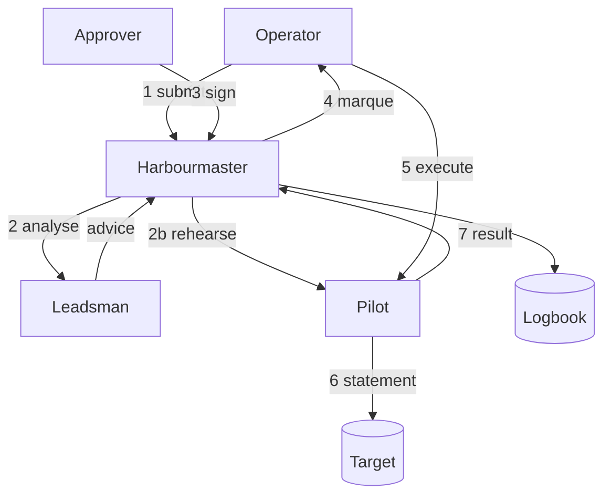

## TL;DR

Marque is a broker for statements run against production data stores. An operator **submits** a
statement naming a target and a role; the system **analyses** it; a human with authority over that
target **approves** it by signing a **marque** — a scoped, time-bounded, revocable grant; the
submitter **executes** under that marque; everything lands in an append-only **logbook**.

The system is a small cast of components with sharply different trust:

| Component | Plane | Holds | Never does |
|---|---|---|---|
| **Harbourmaster** | control | requests, policy, delegations, the logbook | touch a target database, or hold a target credential |
| **Pilot** | data | target credentials (by reference), the connection | decide whether something may run |
| **Leadsman** | advisory | nothing durable | approve, deny, or execute anything |
| **Surveyor** | conformance | nothing durable | widen a bound, deny anything, or resolve doubt toward yes |
| **Tender** | transport | nothing | interpret, or terminate, what it relays |

*(The Surveyor was added by [EDR-0017](./0017-conformance-matching-may-route-never-widen.md); the
original four are otherwise unchanged.)*

Three properties are the point of the design, and every later record defends one of them:

1. **Authority is a signed artefact, not a database row.** The Pilot verifies a marque by
   computation, not by asking the Harbourmaster's opinion.
2. **No component holds both the authority to permit and the ability to act.** Compromising the
   control plane yields no execution; compromising the data plane yields no authority.
3. **Nothing is anonymous.** Every request, analysis, approval and execution names a principal —
   including the machine ones.

## Context

Every organisation that runs a database in production eventually needs to change something in it by
hand: correct a botched migration, unstick a customer, flip a flag that has no admin surface yet.
The usual answers are all bad in the same way.

- **Standing credentials.** Someone has a production password. It never expires, its use is
  invisible, and the blast radius is the whole schema.
- **A shared console with an audit log.** Better, but the audit log records *that* a session
  happened, not what was authorised. Nobody approved anything; the log is a receipt, not a control.
- **A Slack thread and a screen share.** The approval is real and human, and then it evaporates. Six
  months later nobody can reconstruct who agreed to what, and the reviewer's understanding of the
  statement is gone.
- **Locking it down entirely.** Then the on-call engineer at 3am has no path, and someone keeps a
  break-glass credential in a password manager, which is answer one with extra steps.

The failure common to all four is that **the authorisation and the action are not the same object**.
Something is approved in one system (a person's memory, a chat message) and executed in another (a
psql session), with nothing binding them together. There is no artefact you can point at that says
*this exact statement, by this person, as this role, until this time*.

Marque exists to make that artefact real, and to make it the only way in.

Two other forces shape the design.

**It is incident tooling.** [ZFN-4](https://zrz.io/zfn/4-incident-tooling-independence/) says
anything you need during an incident must not depend on what it might have to recover. Marque will
be reached for precisely when things are broken, which rules out a design where an unreachable
control plane means an unexecutable grant.

**It processes adversarial input.** Not from attackers, initially, but from tired people at 3am and
from a language model reading their SQL. Both are capable of producing a statement that does
something other than what everyone believes it does. The system's job is to make the gap between
"what we think this does" and "what this does" as small as it can be made, and to fail closed on the
remainder.

## Decision

Marque brokers every statement through the following flow. Numbers correspond to the object model
below.

**The object model.**

- **Principal** — a human operator or a workload, always from a federated identity provider. There
  is no local password and no "system" actor
  ([ZFN-40](https://zrz.io/zfn/40-no-anonymous-system-actor/)). See
  [EDR-0003](./0003-federated-identity-and-sender-constrained-tokens.md).
- **Target** — a data store Marque can reach: engine, environment, criticality, and how to get to it
  ([EDR-0014](./0014-relay-for-targets-with-no-inbound-route.md)).
- **Role** — a named credential *on* a target, held as a reference and dereferenced at connect time
  ([ZFN-35](https://zrz.io/zfn/35-dereference-secrets-not-store-in-config/)). Every statement names
  one. See [EDR-0006](./0006-every-statement-names-a-role.md).
- **Request** — one or more statements, a target, a role, and a reason, from a submitter. Its
  identity is the canonical digest of its statements.
- **Analysis** — the Leadsman's report on a request: what it touches, what a rehearsal changed, what
  it resembles. Advice ([EDR-0009](./0009-the-leadsman-is-advisory.md)).
- **Marque** — the grant. Binds a statement digest to a target, a role, a submitter, a validity
  window and an execution budget, signed by the approver
  ([EDR-0004](./0004-marques-are-signed-leases.md)).
- **Execution** — one run of a marque, fenced by a nonce
  ([EDR-0011](./0011-execution-is-idempotent-and-fenced.md)).
- **Standing order** — a parameterised statement approved once and invoked without queueing, with
  per-parameter constraints ([EDR-0008](./0008-standing-orders.md)).
- **Delegation** — a grant of *approval* authority over a scope, so authority can be pushed down
  without pushing credentials down ([EDR-0007](./0007-delegation-by-containment-proof.md)). It may be
  written in plain language and compiled for signature
  ([EDR-0016](./0016-natural-language-delegations-are-compiled.md)).
- **Task** — an agent's declaration of the narrowest scope it needs for one piece of work. An agent
  is a submitter, never an approver, and its effective scope is the intersection of operator policy,
  its human's delegation, and this declaration
  ([EDR-0018](./0018-agents-are-submitters-under-intersected-scope.md)).
- **Escalation chain** — the ordered sequence of humans asked when a request falls outside its
  submitter's scope ([EDR-0019](./0019-escalation-is-a-chain.md)).
- **Logbook entry** — the append-only record ([EDR-0012](./0012-the-logbook-is-append-only.md)).

**The plane split** follows
[ZFN-16](https://zrz.io/zfn/16-separate-data-plane-control-plane/), with one addition specific to
this system: it is also a **privilege** split. The Harbourmaster decides and never acts; the Pilot
acts and never decides. Neither alone is sufficient to change a row.

**Scope of this record.** It fixes the components, the object model, and the two invariants above.
It does not fix the API shape, the storage engine, the deployment topology, or the policy language;
those are separate records.

## Consequences

**Easier.**

- "Who changed this, and who said they could?" is a single query against one table, and the answer
  includes the statement text, the analysis the approver saw, and their signature over it.
- Access can be granted narrowly and briefly without anyone handling a credential. The unit of
  sharing is a grant, not a password.
- A compromise is bounded by construction rather than by policy: control-plane compromise yields
  requests nobody signed; data-plane compromise yields the ability to execute grants that do not
  exist.

**Harder.**

- **It is now in the path of every emergency.** Marque's availability is production's availability,
  for a class of incident. [EDR-0004](./0004-marques-are-signed-leases.md) buys most of this back by
  making an issued marque verifiable offline, but the submit-and-approve path genuinely does add a
  dependency where there was none.
- **Approvers must be present.** A control that nobody is available to operate becomes a control
  people route around. Standing orders ([EDR-0008](./0008-standing-orders.md)) and delegation
  ([EDR-0007](./0007-delegation-by-containment-proof.md)) exist to keep the queue short enough that
  the queue is respected.
- **Four components, not one.** More to deploy, more to monitor, more to keep in step. This is the
  deliberate-complexity trade in [ZFN-20](https://zrz.io/zfn/20-deliberate-complexity-is-often-simpler/):
  the single-binary version is simpler to stand up and considerably worse to live with, because it
  collapses the privilege split that is the entire security argument.

**New obligations.**

- Every component runs as a named workload identity with its own credentials, and the audit schema
  carries actor *and* principal on delegated actions
  ([ZFN-38](https://zrz.io/zfn/38-agents-are-principals/)).
- The bypass path — direct credentials to a target — has to be closed as Marque is adopted, or the
  control is decorative. Marque does not enforce this; the target's own grants do.

## References

- [ZFN-4](https://zrz.io/zfn/4-incident-tooling-independence/) — incident tooling must not depend on
  what it recovers.
- [ZFN-16](https://zrz.io/zfn/16-separate-data-plane-control-plane/) — separate the planes.
- [ZFN-20](https://zrz.io/zfn/20-deliberate-complexity-is-often-simpler/) — the simplest-looking
  system is often the most complex to live with.
- [ZFN-43](https://zrz.io/zfn/43-name-systems-as-archetypes/) — the cast list is
  [an architecture document](../content/concepts/cast.md), not decoration.

## Changelog

- **2026-08-15**: Accepted.
- **2026-08-15**: Amended for the agent surface added by
  [EDR-0016](./0016-natural-language-delegations-are-compiled.md) through
  [EDR-0019](./0019-escalation-is-a-chain.md): the component table gains the Surveyor, and agents
  are named as submitters in the object model. The decision is unchanged — the same plane split, the
  same two invariants, and the same rule that no component holds both the authority to permit and
  the ability to act.
