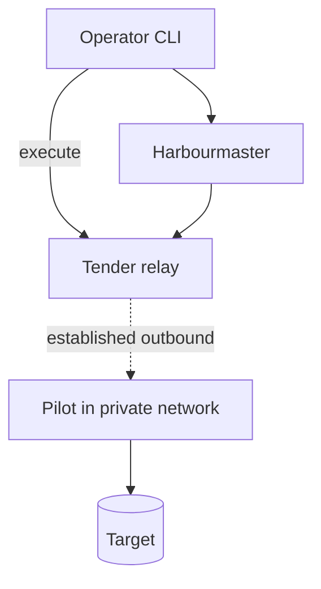

## TL;DR

Most production databases have no route from anywhere a control plane can reach them, and that is
correct. Marque handles it by **reversing the direction**: a Pilot deployed inside the private
network dials *out* to a **Tender** — a relay with a public endpoint — authenticates with its own
workload identity, and serves requests over that long-lived connection.

- **No inbound port** is opened anywhere. The private network's only new flow is one outbound TLS
  connection.
- **The Tender is a dumb pipe.** It authenticates both ends, matches a Pilot to a request, and copies
  bytes. It does not terminate the Marque session, cannot read a statement or a result, and holds no
  key that would let it.
- The Tender runs in an **isolated network tier** with no route to internal services, so a compromise
  of the one internet-facing component reaches nothing
  ([ZFN-11](https://zrz.io/zfn/11-outbound-http-egress-proxy/) is the same containment argument in
  the outbound direction).
- The Pilot is **not** a general-purpose tunnel. It speaks the Pilot API and nothing else. There is
  no port-forward, no shell, no arbitrary-TCP mode — that is what makes it deployable in a network
  where a bastion would not be.

## Context

The alternatives all fail, differently:

- **Open the database to the control plane.** Now the database has an inbound route from a
  network someone else operates. Whatever the firewall rules say, it is one misconfiguration from
  public, and every serious environment will refuse this.
- **A bastion with SSH tunnels.** It works — Protect operates exactly this — but it needs an inbound
  port, a host to patch, and a credential path to the bastion. Worse, a tunnel is *general*: whoever
  can open one can forward any port, so the bastion's authorisation must be as strong as direct
  database access. It is a fine operator tool and a poor foundation for automated access.
- **A Pilot per network with its own public endpoint.** Then every private network operator must
  publish and defend an ingress, which is exactly what they were avoiding.
- **VPN or private peering between control plane and every target network.** Heavy, per-customer, and
  it joins networks that had good reasons to be separate.

Reversing the direction is well-trodden — it is how agent-based monitoring, CI runners and
inbound-less connectivity products all work — and it is the right trade here because Marque's data
plane is a *service*, not a session. A Pilot serves a narrow API. Nothing needs to reach into the
network; something inside it needs to offer a specific capability outward.

The user-facing requirement is that this must work on both AWS and GCP without either becoming
special, so the relay authenticates workload identity from either
([EDR-0003](./0003-federated-identity-and-sender-constrained-tokens.md)) rather than depending on a
cloud-specific connectivity primitive.

## Decision

**Registration.** A Pilot starts, authenticates to the Tender with its workload identity, and
registers the targets it can serve. **A registration is validated against the configured
target→Pilot map** ([EDR-0015](./0015-policy-is-reviewed-configuration.md)): a Pilot claiming a target
it was not assigned is refused and reported, since a self-asserted claim would let a Pilot volunteer
for someone else's database.

**Relay selection and failover.** A Pilot is given an ordered list of relay addresses from the
bootstrap document's `relays` block ([EDR-0002](./0002-bootstrap-discovery-document.md)), dials them in
order, and fails over with **jittered** backoff — an unjittered herd reconnecting after a relay
restart is its own outage. Each Pilot reports which relay it is attached to.

The Tender records `pilot-id → connection` and reports the Pilot as reachable. A Pilot with no
registered connection is reported unreachable, and requests for its targets fail fast with that
reason rather than timing out.

**The relay is a pipe, not a proxy.**

- The Marque session is **end-to-end between the client and the Pilot**, authenticated and encrypted
  such that the Tender is not a party. The Tender sees framed, opaque bytes.
- The Tender enforces exactly three things: both ends are authenticated, the requested Pilot is the
  one the request names, and per-connection rate and concurrency limits.
- **It never speaks the Pilot API.** It cannot parse a statement, and a compromised Tender yields
  traffic analysis — which Pilot is busy, how often — and denial of service, not disclosure.

**Direct connection stays the simple case.** Where the Pilot *is* reachable, clients connect
directly; the bootstrap document says which mode each Pilot uses
([EDR-0002](./0002-bootstrap-discovery-document.md)) and the client code path is otherwise identical.
The relay is one deployment topology, not a requirement.

**Deliberately not a tunnel.** No port forwarding, no arbitrary TCP, no interactive session. The
Pilot exposes the Pilot API, so the worst a fully-compromised Tender plus a stolen client credential
achieves is "execute a marque you already hold" — bounded by everything in
[EDR-0004](./0004-marques-are-signed-leases.md). A tunnel would make it "reach anything in the
network".

**Connection discipline.** Long-lived connections through load balancers die quietly at idle
timeouts, and a Pilot that believes it is registered but is not looks exactly like a healthy Pilot
until the first request fails. Application-level keepalives run inside the relay's own idle timeout,
and both ends treat a missed keepalive as a disconnect and re-register.

**Isolation.** The Tender runs in a dedicated network tier: outbound denied to internal ranges and to
the cloud metadata endpoint, no credential beyond its own identity, and no route by which it can
initiate a connection inward.

## Consequences

**Easier.**

- Marque deploys into networks that would never accept a bastion, which is most of the interesting
  ones — including a target in a different cloud from the control plane.
- The network change to adopt Marque is one outbound flow, which is a small ask in a review.
- No inbound port and no bastion host to patch removes a whole category of standing exposure.

**Harder.**

- **A new internet-facing component**, which is precisely the thing this system should have as little
  of as possible. Keeping it a dumb pipe is the entire mitigation, and every future feature request
  for it ("could the relay cache…", "could the relay retry…") should be refused on principle.
- **Long-lived connections are operationally fiddly**: idle timeouts, half-open sockets, rolling
  restarts that disconnect every Pilot at once, thundering-herd reconnects. Reconnect backoff must be
  jittered.
- Relay capacity becomes a shared resource across every private target, so one busy Pilot can affect
  others without per-connection limits.
- End-to-end session security between client and Pilot means the Pilot terminates its own
  authenticated channel — more Pilot code, in the component that should stay smallest. It is worth
  it: the alternative is trusting the relay.

**New obligations.**

- Pilot reachability is a first-class health signal, surfaced in the console and alerted on. A Pilot
  that silently deregistered is discovered at the worst possible moment otherwise.
- The relay's isolation is asserted by an infrastructure test, not by having been set up correctly
  once.

## References

- [ZFN-11](https://zrz.io/zfn/11-outbound-http-egress-proxy/) — isolate the component that touches
  the untrusted network.
- [ZFN-4](https://zrz.io/zfn/4-incident-tooling-independence/) — the relay must not be a dependency
  the tool cannot survive losing.
- [EDR-0002](./0002-bootstrap-discovery-document.md) — how a client learns a Pilot's reachability
  mode.
- [EDR-0005](./0005-control-plane-holds-no-credentials.md) — why the Pilot is inside the network in
  the first place.

## Changelog

- **2026-08-15**: Accepted.
- **2026-08-16**: Amended after the expert panel's should-fix pass: a Pilot's registration is validated against the configured target→Pilot map rather than self-asserted, and relay selection and jittered failover are specified.
