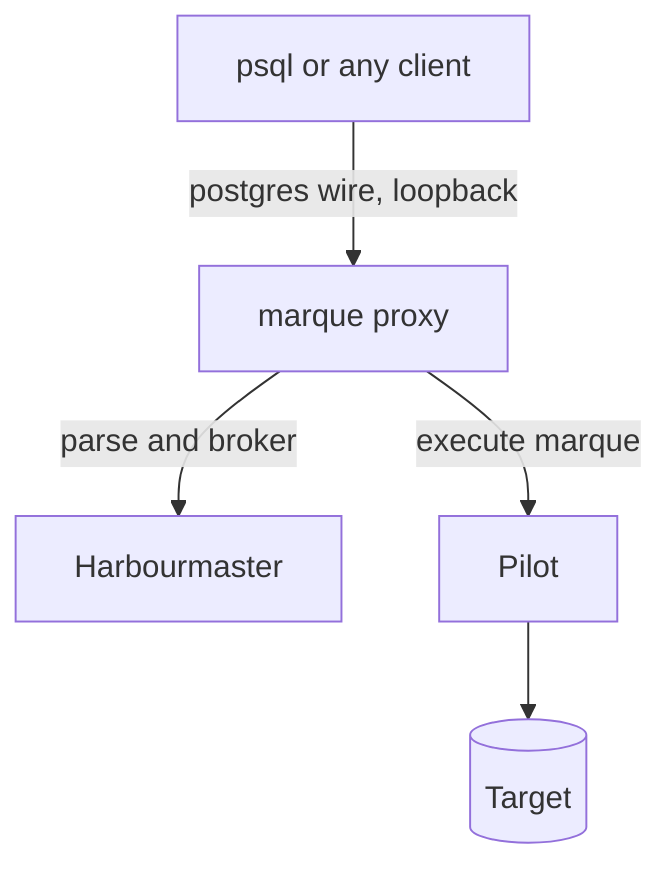

## TL;DR

Two surfaces on the same core:

```sh
marque sql   --target prod-primary --role settings_writer      # an interactive shell
marque proxy --target prod-primary --role settings_writer --port 15432
psql "host=127.0.0.1 port=15432 dbname=app"                     # your existing tools, unchanged
```

The proxy **emulates the PostgreSQL frontend/backend protocol** on loopback. Your client believes it
is talking to PostgreSQL. Every statement it sends is parsed, scoped, fenced, executed through a
Pilot under a minted marque, and logged — exactly as if it had been submitted on the command line.

**It forwards no bytes.** There is no socket from the proxy to your database carrying your client's
traffic; the proxy is a protocol *terminator* that constructs its own requests and renders results
back into wire format. That is what separates this from a tunnel, and it is the entire reason the
feature is compatible with the rest of the design.

A statement outside your scope does not hang. It returns a `42501` error naming the request id and
the escalation chain, so you can approve it elsewhere and re-run:

```
ERROR:  outside your delegated scope; submitted for approval
DETAIL:  req_01JB2Q9F3K8Z — waiting on sam@acme.example, then group:data-oncall
HINT:  re-run this statement once approved, or watch: marque watch req_01JB2Q9F3K8Z
```

## Context

The scope document originally listed "an interactive SQL client" as a non-goal, on the reasoning that
exploration is a different product with a different security model. That reasoning was about
*exploration*; it was wrongly applied to the *interface*.

The practical problem it created: people have tools. They have psql muscle memory, a query editor
with their history in it, a script that already knows how to format output. Requiring every statement
to be pasted into `marque submit` is a tax on exactly the routine work that Marque most needs to
capture, and taxed routes get avoided. The predictable outcome of an awkward interface is a direct
credential kept "just for reads".

The insight that resolves it is that **the interface and the control are separable**. Nothing about
speaking the PostgreSQL wire protocol requires relaxing a single check. A statement arriving over a
socket is the same statement arriving over gRPC — it gets the same parse, the same scope decision,
the same fence, the same logbook entry. What the client gets is a familiar way to send it and a
familiar way to read the answer.

There is a second, unearned benefit. The protocol's **extended query flow** sends the statement text
(`Parse`) and its parameter values (`Bind`) as separate messages. A client using prepared statements
therefore hands Marque a statement whose parameters are already values rather than syntax — the exact
property [EDR-0008](./0008-standing-orders.md) has to enforce by hand for standing orders, arriving
for free from the protocol.

## Decision

### What the proxy is

A **loopback-only** PostgreSQL protocol server, run by the operator's own CLI, on their own machine.
It is not a deployed component: it holds no target credential, and it reaches the database only by
asking a Pilot, as any other client does
([EDR-0005](./0005-control-plane-holds-no-credentials.md)).



**Binding and local authentication.** It binds `127.0.0.1` only, never a routable address, and
refuses to start otherwise. Local clients authenticate with **SCRAM-SHA-256** using a random
per-session password the CLI prints — loopback is not a trust boundary on a shared machine, and
`trust` auth would let any local process use the operator's authority. `SSLRequest` is answered with
a refusal, which every client handles by continuing in cleartext over loopback.

### Supported shape, and what is refused

Supported: the simple query flow, the extended query flow (`Parse`/`Bind`/`Describe`/`Execute`/
`Sync`), `RowDescription`/`DataRow`/`CommandComplete`, `ErrorResponse` and `NoticeResponse`, cancel
requests, and the `ParameterStatus` values clients need at startup.

**Explicit client transactions are refused in the first release.** `BEGIN` returns an error pointing
at `marque submit`. This is the honest limitation: a marque authorises a statement set decided in
advance, and an open transaction is a client deciding what to do next based on what it just saw —
which cannot be approved before it happens. Multi-statement work goes through a request, where all
statements are approved and executed in one transaction
([EDR-0007](./0007-delegation-by-containment-proof.md)). Every statement over the proxy is therefore
its own implicit transaction, with the same fence and assertions as any other execution.

Also refused, with a specific message rather than a protocol error: `COPY` in either direction, and
anything outside the checkable statement grammar. `SET` is accepted for a small allowlist of session
settings that cannot affect authorisation, and refused otherwise.

**Result bounds.** Rows and bytes are capped per statement, configurable and defaulted low. Exceeding
the cap ends the result set with a notice saying so rather than truncating silently. A proxy is a
convenient way to accidentally pull a table onto a laptop.

### How a statement is handled

1. Parse it. Outside the grammar → error, with the reason
   ([EDR-0007](./0007-delegation-by-containment-proof.md)).
2. Is it covered by a standing order, a delegation, or the current task's scope? If yes, mint a
   marque and execute through the Pilot, streaming rows back as they arrive.
3. If no, submit it as a request, compute the escalation chain, and **return a `42501` error
   immediately** carrying the request id and who is being waited on
   ([EDR-0019](./0019-escalation-is-a-chain.md)). The session stays usable.
4. Everything lands in the logbook identically to a command-line submission. There is no
   "proxy mode" in the record, because there is no difference in what happened.

**Blocking is opt-in**, per session or per statement (`marque proxy --wait 5m`), for the case where
an operator would rather the client wait than re-run. It defaults off, because a psql session hung
for twenty minutes with no output is indistinguishable from a broken one.

**Reads are marked.** A read served from a replica emits a `NoticeResponse` naming the observed lag
([EDR-0021](./0021-connections-identity-and-read-routing.md)), so a stale answer is never mistaken
for a current one.

### `marque sql`

The same core with a terminal in front of it: readline, history, formatted output, and the escalation
message inline. It exists because it is a better experience than psql-through-a-proxy for the common
case, and because it needs no local port at all.

## Consequences

**Easier.**

- People keep their tools, their history and their habits, which is the difference between a control
  being used and being routed around.
- Every statement those tools send becomes a logbook entry. The interface that captures the most
  traffic is now the one that is most convenient, which is the right way round.
- Prepared statements give parameterised execution for free.

**Harder.**

- **The PostgreSQL protocol is a large surface to emulate**, and a partial implementation fails in
  client-specific ways — a GUI tool issuing an introspection query the proxy does not expect will
  present as "cannot connect" with no useful detail. Compatibility is a per-client test matrix, and
  it is the main cost of this decision.
- **Refusing `BEGIN` will be the top complaint.** It is correct, and it is a real limitation for
  anyone whose workflow is transactional.
- **The proxy is the most attractive thing in the system to weaken.** Every request to "just let it
  pass through for reads" or "let it hold a connection" moves it toward being a tunnel, which would
  discard the property that makes it acceptable. It forwards no bytes; that is not negotiable
  without a superseding record.
- Introspection queries from GUI clients will generate logbook volume that is uninteresting. They are
  reads, they are cheap, and they are still recorded — the alternative is an unlogged path, which is
  worse.
- A local port is a local attack surface. Loopback binding plus SCRAM with a per-session password is
  the mitigation; a compromised local account is out of scope, as it already is for the CLI's keys.

**New obligations.**

- A client compatibility suite — psql, a common GUI client, and at least one language driver — runs
  in CI, because "works with psql" is not the same claim as "works".
- The refusal list is documented in the CLI's own help, since the error arrives inside somebody
  else's tool where they cannot read the docs.

## References

- [ZFN-4](https://zrz.io/zfn/4-incident-tooling-independence/) — the interface used during an
  incident must be the familiar one.
- [ZFN-30](https://zrz.io/zfn/30-use-standards-dont-reinvent/) — speak the protocol the ecosystem
  already speaks rather than inventing a client.
- [EDR-0014](./0014-relay-for-targets-with-no-inbound-route.md) — the other place "this is not a
  tunnel" is load-bearing.
- [EDR-0021](./0021-connections-identity-and-read-routing.md) — replica routing and staleness
  reporting, surfaced here as notices.

## Changelog

- **2026-08-15**: Accepted.
