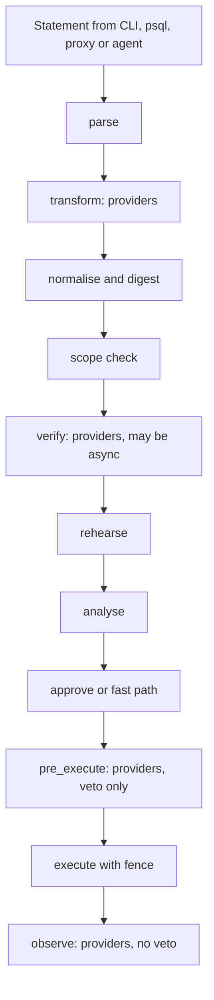

## TL;DR

Every statement, from every surface, moves through a named pipeline. Configured **providers** may
join four of its stages — two that can change an outcome:

- **`transform`** — rewrite the statement. Inject a constraint, rename a column or table, synthesise
  a value, add a cast.
- **`verify`** — inspect and veto. May be **asynchronous**: call a data-classification service, check
  for an open change freeze, require a linked ticket.

One rule governs all of it, and it is the reason this is safe to open up:

> **A provider may narrow or veto. It can never widen, permit, or replace a check.**

Three mechanisms enforce that rather than asking for it:

1. **The digest is taken *after* transformation.** The marque signs what will actually run, so a
   human approving it is approving the transformed statement, with the original shown beside it
   ([EDR-0004](./0004-marques-are-signed-leases.md)).
2. **Scope and fence re-run on the transformed statement.** A transform that widened would fail the
   containment check ([EDR-0007](./0007-delegation-by-containment-proof.md)), so a rogue provider is
   bounded by the submitter's own authority — it cannot reach beyond what they already had.
3. **Providers are additive only.** There is no stage at which a provider can disable the fence, the
   magnitude assertion, marque verification, or the role. Those are unconditional and unpluggable.

Providers run **out of process**, over the same schema-first API as everything else
([EDR-0020](./0020-one-schema-generates-every-client.md)) — not as code loaded into the control
plane's address space.

## Context

Real deployments need statement handling this design does not have and should not hard-code:

- **Constraint injection.** A multi-tenant customer database where every statement must carry
  `AND tenant_id = '…'`, derived from the request context rather than typed by the operator.
- **Name mapping.** A migration in flight where a logical column name must resolve to a physical one,
  so operators and runbooks do not have to know which side of the migration they are on.
- **Value synthesis and casting.** Filling `updated_at`, coercing a parameter to the column's actual
  type, adding an audit column.
- **Asynchronous verification.** "Does this touch a column classified restricted?", "is there a
  change freeze?", "is there an open ticket for this?" — questions whose answers live in another
  system and take time.

Hard-coding these would be wrong twice over: they are organisation-specific, and the list is
open-ended. But an extension point in an authorisation system is exactly where a security property
goes to die — every plugin interface eventually grows a way to say "allow this", because somebody
has a legitimate-sounding case for it.

The tension worth naming: [EDR-0007](./0007-delegation-by-containment-proof.md) explicitly refuses to
conjoin a delegation's predicate into an operator's `WHERE`, on the grounds that silently narrowing a
statement produces a partially-applied change nobody reviewed. Constraint injection is that same
operation. The difference is **visibility**, not the rewrite: a transform's output is what gets
digested, displayed, approved and signed, so the review happens on the thing that will actually run.
The fence could not do that, because the fence runs after approval, inside the transaction.

## Decision

### The pipeline

| Stage | Providers may | Notes |
|---|---|---|
| `parse` | — | engine-supplied ([EDR-0026](./0026-a-second-engine-is-a-capability-matrix.md)) |
| **`transform`** | rewrite the statement | runs **before** the digest, so the result is what gets signed |
| `normalise` | — | canonicalise, take the digest |
| `scope` | — | unconditional containment check |
| **`verify`** | veto, **asynchronously** | the request may sit in `verifying`; deadlines apply |
| `rehearse` | — | [EDR-0010](./0010-rehearse-before-you-sign.md) |
| **`analyse`** | contribute evidence — no transform, no veto, no route | [EDR-0009](./0009-the-leadsman-is-advisory.md); a failure here never blocks |
| **`pre_execute`** | veto only | last look at the bound statement, after approval; **cannot transform** |
| **`observe`** | nothing | post-outcome notification; a veto here would be a lie, it already ran |

**Transforms do not run on a standing-order fast path.** A standing order is a fixed shape a human
signed, and [EDR-0029](./0029-the-fast-path-authority-chain.md) step 5 requires the Pilot to
recompute `template + binding` offline and require the digest to equal `req`. A transform would make
that recomputation fail — or, worse, force the Pilot to run provider code to reproduce it. A
deployment needing tenant scoping on a standing order puts the constraint **in the template**, where
it was reviewed and signed. Transforms apply to interactive and delegated paths, where the digest is
taken after them and a human or a compiled scope covers the result.

**Transforms run exactly once, and their output is frozen.** Value synthesis is otherwise a
correctness bug: a provider that injects `now()` would produce different text at rehearsal and at
execution, so the rehearsed statement would not be the executed one. The transformed text is stored
on the request, and rehearsal, approval and execution all use that frozen text.

**Transforms must be deterministic given `(statement, context)`** and idempotent. A provider that
needs a timestamp receives one in the context rather than reading a clock.

### Ordering, configuration and review

Providers are declared in the same reviewed configuration as policy
([EDR-0015](./0015-policy-is-reviewed-configuration.md)), per target, with a stage and an explicit
order. Ties break by name, so the chain is deterministic. The chain and each provider's version are
recorded on the request, so what happened is reproducible.

**Configuration is where the review happens.** An always-applied transform such as tenant scoping is
reviewed once, by whoever configured it, exactly as a standing order is reviewed once
([EDR-0008](./0008-standing-orders.md)) — and every application is still shown and recorded. This is
what makes a transform acceptable on a fast path where no human sees the individual request.

**Providers are deployment-configured, never tenant-supplied.** They see statement text, which is
sensitive. First release: a provider is a small service the deployment operator runs and declares.
Tenant-supplied providers are a different security problem and are out of scope.

### Failure semantics

| Stage | On provider error or timeout |
|---|---|
| `transform` | **the request fails.** Never "skip and continue" — a skipped tenant-scoping transform is a data breach, and skipping is the failure mode a tired operator would configure |
| `verify` | `fail` (default) or `refer` to a human, declared per provider. Never "allow" |
| `pre_execute` | the execution fails |
| `observe` | logged; the execution already happened |

Every stage has a deadline. `verify` providers may take minutes; the request shows which provider it
is waiting on, exactly as an escalation shows its stage
([EDR-0019](./0019-escalation-is-a-chain.md)).

### What moves onto the SPI, and what must never

The question this record was written to answer.

**Moves onto it** — these are already advisory or evidential, and expressing them as providers makes
the pipeline honest and lets deployments substitute their own:

| Today | Becomes |
|---|---|
| The Leadsman's analysis ([EDR-0009](./0009-the-leadsman-is-advisory.md)) | an `analyse` provider. `analyse` is therefore a **fourth** provider-joinable stage, contributing evidence only: it cannot transform, veto or route, and its failure never blocks a request |
| The Surveyor's conformance judgment ([EDR-0017](./0017-conformance-matching-may-route-never-widen.md)) | a **routing** provider at `verify`, whose outcomes are `conforms`/`refer`. It selects a route inside a human-signed bound; it **cannot deny** — denial is a human act. This is narrowing in the record's sense (it can only send work *to* a human, never past one), not the `veto` outcome defined below |
| Change-freeze, ticket linkage, data classification | `verify` providers |

**Never moves onto it.** These are the design, and a pluggable version of any one is a disableable
version of it:

- the containment/scope check ([EDR-0007](./0007-delegation-by-containment-proof.md))
- the transactional fence — pre-check, post-assert, magnitude
- marque signature verification and expiry ([EDR-0004](./0004-marques-are-signed-leases.md))
- the execution nonce and budget ([EDR-0011](./0011-execution-is-idempotent-and-fenced.md))
- the role and its grants ([EDR-0006](./0006-every-statement-names-a-role.md))
- writing the logbook ([EDR-0012](./0012-the-logbook-is-append-only.md))

The line is simple enough to apply without consulting this record: **if disabling it would let
something run that otherwise could not, it is not a provider.**

### Not a member of the cast

The pipeline is a mechanism and providers are other people's code, so both get plain descriptive
names. [ZFN-43](https://zrz.io/zfn/43-name-systems-as-archetypes/) reserves archetypes for the
long-lived cast with real agency and warns that mythologising everything devalues the names that
matter — a provider is precisely the thing that should read as ordinary and replaceable.

## Consequences

**Easier.**

- Organisation-specific handling stops being a fork. Tenant scoping, name mapping and classification
  checks become configuration rather than patches to the core.
- Asynchronous verification against external systems is expressible without putting a network call on
  the approval path by hand.
- The pipeline becomes a stated artefact, which makes the order of operations reviewable — several
  ordering constraints here (digest after transform, re-check after transform, freeze before
  rehearsal) were implicit and are now explicit.

**Harder.**

- **This is the most likely place for the design to be undermined later**, and the pressure will be
  reasonable-sounding: an `allow` outcome, a provider that skips the fence for a "trusted" case, a
  tenant-supplied plugin. The additive-only rule is the whole defence and it needs a superseding
  record to change, not a pull request.
- **A transform makes the executed statement differ from the submitted one.** Even shown side by
  side, an operator will eventually be surprised by what ran. Provenance is displayed everywhere the
  statement is, and that mitigates rather than solves it.
- **Providers are new failure surface on the critical path**, and fail-closed means a broken provider
  blocks work — during an incident, potentially. Deadlines, health reporting and a documented "how to
  disable a wedged provider" procedure are required, and disabling one is itself a reviewed change.
- Out-of-process providers add latency and deployment complexity relative to in-process plugins. That
  is the price of not running third-party code inside the control plane, and it is worth paying.
- Determinism and freeze semantics are subtle; a provider author will get them wrong. The SPI's
  conformance suite has to test them.

**New obligations.**

- A provider conformance suite that a provider author runs: determinism, idempotence, deadline
  behaviour, and — the important one — **an attempt to widen, which must be rejected by the
  re-checked scope rather than by the provider being polite**.
- Provider health, latency and veto rates are monitored. A provider vetoing everything and a provider
  that has silently stopped being consulted look identical from the outside otherwise.

## References

- [ZFN-47](https://zrz.io/zfn/47-govern-the-contract-between-teams/) — govern the contract at the
  boundary and enforce it at runtime; ship the extension point as a contract, not a library.
- [ZFN-22](https://zrz.io/zfn/22-extract-complexity-at-the-seam/) — the pipeline stage is the seam.
- [ZFN-43](https://zrz.io/zfn/43-name-systems-as-archetypes/) — why this is not a member of the cast.
- [EDR-0007](./0007-delegation-by-containment-proof.md) — the record whose refusal to rewrite this
  reconciles with, and the check that bounds a rogue transform.
- [EDR-0015](./0015-policy-is-reviewed-configuration.md) — where providers are declared and reviewed.

## Changelog

- **2026-08-15**: Accepted.
- **2026-08-15**: Amended after an expert-panel review found the "what moves onto the SPI" table mis-describing both records it cites. The Surveyor was listed as a `verify` provider with outcomes `veto`/`refer`; its outcomes are `conforms`/`refer`, and `veto` is precisely the power [EDR-0017](./0017-conformance-matching-may-route-never-widen.md) states it must never have — an implementer building from that row would have shipped a Surveyor that can deny. Restated as a routing provider. Also reconciled the `analyse` stage, which the table used and the stage table omitted, and corrected the TL;DR's stage count.
- **2026-08-16**: Amended after a second expert panel: transforms do not run on a standing-order fast path — [EDR-0029](./0029-the-fast-path-authority-chain.md) requires the Pilot to recompute `template + binding` offline and match `req`, which a transform would break. Tenant scoping on a standing order belongs in the signed template.
